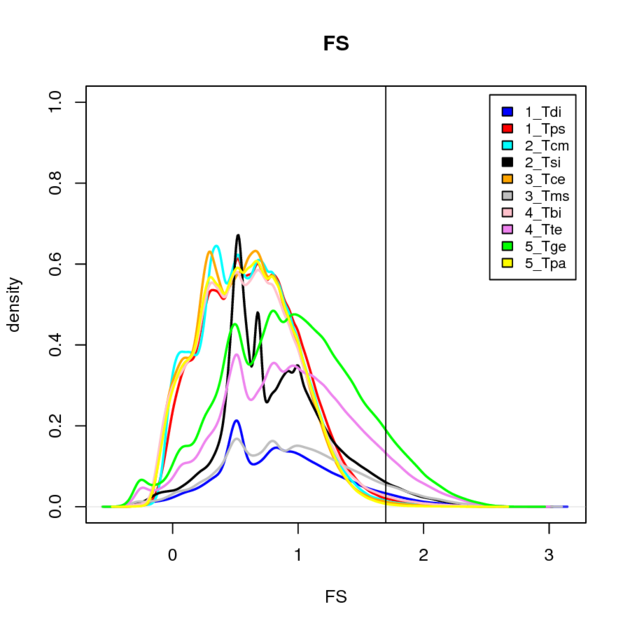
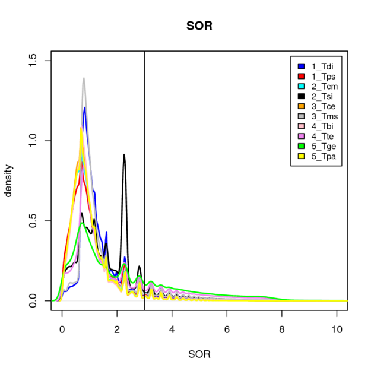
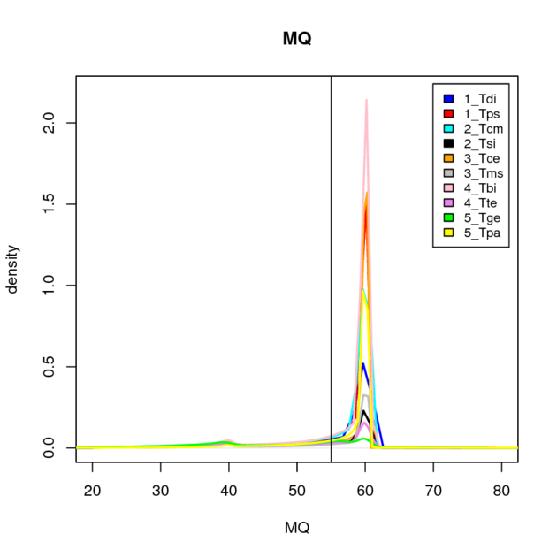
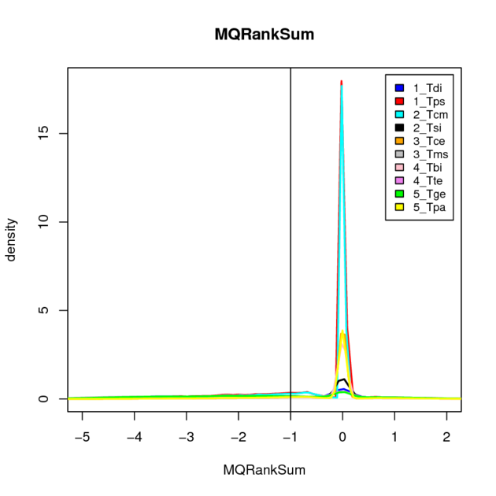
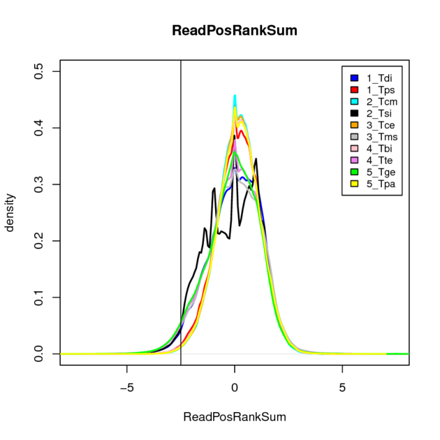

# D - snp calling (preliminary round) :

(go to next step : [base recalibration](../E_recalibration), previous step : [mapping](../C_mapping))

---------

In theory, the base quality score recalibration step (**BQSR**), necessary to correctly ascertain the confidence we can put in each base, should be done **before** the variant (ie, SNP/indel) calling step.
Unfortunately, the **BQSR** step requires an already available set of trustable variant positions, which we don't have when working on non-model organisms such as stick insects.
The work-around is to do a first, preliminary round of variant calling with original base quality scores in order to get a raw set of variants that will be use to mask these positions during the **BQSR** step (so that they are not mistaken for sequencing errors).
Once the bam files have been recalibrated, a new round of variant calling can be performed to obtain a trustable set of variant positions.
Note that this cycle (BQSR/variant calling) can be repeated several times until convergence.
For computational reasons however, we only did a single BQSR step. 


Following commands are given for species '**1_Tdi**' (all runs of each five samples have been merged into a single bam file).


### 0) preliminary step :

Split the genome assemblies in (40) intervals of similar size, this allows some parallelisation :
````
java -jar -Xmx50g Queue.jar -S GenotypeGVCFs.scala -R 1_Tdi_b3v06.fa -o trash -V 1_Tdi.empty.list -run
````
* `GenotypeGVCFs.scala`: [script](./GenotypeGVCFs.scala) for creating intervals.
* `1_Tdi.empty.list`: empty file, we just want the program to create intervals and then stops.


-------------
In the latest version of the *GATK* pipeline, the *variant calling* is performed in two distinct steps (previously grouped into a single analysis).
This new procedure allows to add samples along the way without redoing the whole calculation.

First step is *per-sample calling* followed by *joint genotyping* across all (five) samples. 
This workflow involves running **HaplotypeCaller** on each sample separately in *GVCF mode*, to produce an intermediate file format called **GVCF** (for Genomic VCF, `.g.vcf` extension). 
The GVCFs of multiple samples are then run through a *joint genotyping* step (using **GenotypeGVCFs**) to produce a multi-sample **VCF** callset (which will later be processed to distinguish between true and false (aka errors) variants). 


### 1) per-sample calling with 'HaplotypeCaller' :


**HaplotypeCaller** is able to call SNPs and indels simultaneously via local de-novo assembly of haplotypes in an active region. 
In other words, whenever the program encounters a region showing signs of variation, it discards the existing mapping information and completely reassembles the reads in that region. 
This allows the program to be more accurate when calling regions that are traditionally difficult to call, for example when they contain different types of variants (indels/SNPs) close to each other. 

````
for sample in Tdi_{01,02,03,04,05}
do
java -Xmx20g -jarGenomeAnalysisTK.jar \
   -T HaplotypeCaller \
   -R 1_Tdi_b3v06.fa  \
   -I $sample.bam   \                 
   --genotyping_mode DISCOVERY  \
   --emitRefConfidence GVCF    \
   -o $sample.g.vcf \                
   -hets 0.001   \
   -nct  1
 done
````
* `-hets`: prior on heterozygosity level. We set its value at `0.01` for sexual species and `0.001` for asexuals.


### 2) joint genotyping with 'GenotypeGVCFs' :


'**1_Tdi.gvcf.list' content :**
````
Tdi_01.g.vcf
Tdi_02.g.vcf
Tdi_03.g.vcf
Tdi_04.g.vcf
Tdi_05.g.vcf
````

````
# this step can be parallelised by giving regions to the program
# instead of the complete assembly (as shown below).
java -Xmx20g -jar GenomeAnalysisTK.jar \
   -T  GenotypeGVCFs \
   -R  1_Tdi_b3v06.fa \
   -V  1_Tdi.gvcf.list  \          
   -nt 10   \        
   -o  1_Tdi.allVariant_raw.vcf   
````


### 3) extract SNPs and indels :


````
# Get SNPs only :
vcftools \
    --vcf 1_Tdi.allVariant_raw.vcf \
    --remove-indels      \
    --out 1_Tdi.SNP_raw  \
    --recode             \
    --keep-INFO-all


# Get indels only :
vcftools \
    --vcf 1_Tdi.allVariant_raw.vcf \
    --keep-only-indels     \
    --out 1_Tdi.indel_raw  \
    --recode               \
    --keep-INFO-all
````

#### output files :
````
1_Tdi.SNP_raw.vcf
1_Tdi.indel_raw.vcf
````

**note:** these two sets of variants are not definitive 
(although some tests were applied by *GATK* to remove the most dubious ones).
The **vcf** files contain the list of possible variant positions (one per line), 
each reported position being associated with a lot of extra-information (such as its global and per-sample coverages, 
and different statistics like the score of the call, mapping quality,...).
It is therefore necessary to set criteria to distinguish between real and false variant (see below).

--------------

The best way to filter the resulting variant callset according to *GATK* recommandations 
is to use *variant quality score recalibration* (**VQSR**),
which uses machine learning to identify annotation profiles of variants that are likely to be real. 
The drawback of this sophisticated method is that it requires a highly curated sets of known variants; 
this makes it impossible to apply it to non-model organisms.
Therefore, in our case, the alternative is to use a quite brutal approach where we will use hard thresholds 
on chosen parameters to manually filter the variants...

#### Some links:
https://gatkforums.broadinstitute.org/gatk/discussion/3225/how-can-i-filter-my-callset-if-i-cannot-use-vqsr-recalibrate-variants
https://software.broadinstitute.org/gatk/documentation/article.php?id=2806


### 4) (visually) determine thresholds for hard filtering :

Here are the parameter threshold values that were chosen for **filtering out** SNPs and indels, 
followed by plots of their distributions (for SNPs) to justify our choices
(although our values differ a bit from those recommended by *GATK* on their own human dataset,
we made use of their graphical recommendations:
https://software.broadinstitute.org/gatk/documentation/article.php?id=6925).

#### thresholds for SNPs :
````
QD < 5.0                       # Quality by Depth (weight call score by the coverage)
FS > 50.0                      # Fisher Strand (probability of strand bias at the site)
SOR > 3.0                      # Strand Odds Ration (another way to estimate strand bias)
MQ < 55.0                      # Mapping Quality 
MQRankSum < -1.0               # do read with ALT allele have a different mapping quality 
ReadPosRankSum < -2.5          # are read positions for REF allele different than ALT allele
````

#### thresholds for indels :
````
QD < 5.0
FS > 25.0
SOR > 3.5
ReadPosRankSum < -2.5
````

#### parameter distributions for SNPs :


**note:** it is interesting to remark that while sexual species exhibit the expected distribution pattern for the **QD** parameter, asexual species (in *grey*, *black*, *blue*, *green* and *violet*) seem to have a different shape, mostly lacking the central pic (the pic on the left corresponding to errors).








### 5) apply hard filters to variants :

#### command for SNP vcf :
````
java -jar GenomeAnalysisTK.jar \
    -T VariantFiltration    \
    -R 1_Tdi_b3v06.fa       \
    -V 1_Tdi.SNP_raw.vcf    \                                   
    -o 1_Tdi.SNP_filter.vcf \                                  
    --filterExpression  "QD < 5.0"    --filterName "badQD"  \
    --filterExpression  "FS > 50.0"   --filterName "badFS"  \
    --filterExpression  "SOR > 3.0"   --filterName "badSOR" \
    --filterExpression  "MQ < 55.0"   --filterName "badMQ"  \
    --filterExpression  "MQRankSum < -1.0"          --filterName "badMQRankSum"    \
    --filterExpression  "ReadPosRankSum < -2.5"     --filterName "badReadPosRankSum"  
````

#### output :
````
1_Tdi.SNP_filter.vcf
1_Tdi.indel_filter.vcf
````
These first sets of variants will be used in the following **BQSR** step to mask their position (so that they are not mistaken for sequencing errors).

