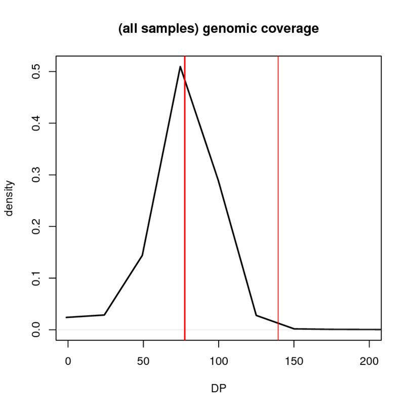

# F - snp calling (final round) :

(go to previous step : [base recalibration](../E_recalibration))

---------

Base quality scores now being recalibrated, we can perform a definitive round of variant (SNP/indel) calling. Explanations about the pipeline are mainly given here : [snp calling (first round)](../D_snp_calling_round0). In this section, we mostly emphasise on the differences between the two rounds.

Following commands are given for species '**1_Tdi**' (samples : *Tdi_01*, *Tdi_02*, *Tdi_03*, *Tdi_04*, *Tdi_05*).


### 1) per-sample calling with 'HaplotypeCaller' :


**HaplotypeCaller** calls SNPs and indels simultaneously via local de-novo assembly of haplotypes in an active region. 

````
# SAME COMMAND THAN AT FIRST ROUND :
for sample in Tdi_{01,02,03,04,05}
do
java -Xmx20g -jarGenomeAnalysisTK.jar \
   -T HaplotypeCaller \
   -R 1_Tdi_b3v06.fa  \
   -I $sample.recal.bam   \            # input file
   --genotyping_mode DISCOVERY  \
   --emitRefConfidence GVCF    \
   -o $sample.g.vcf \                  # output file
   -hets 0.001   \
   -nct  1
 done
````
* `-hets`: prior on heterozygosity level. Its value was set at `0.01` for sexual species and `0.001` for asexuals (this is the only moment in the pipeline where sexual and asexual species are treated differently). As a quick control, we redid the snp calling for **1_Tdi** (which is asexual) by giving it the heterozygosity value of sexual species (ie, `0.01`). We found a very similar number of validated snps (ie *2,211,875* instead of *2,209,794*, which is *2081* additional snps, see also [summary tables](#stat)). This suggests a limited influence of this prior on the results.


### 2) joint genotyping with 'GenotypeGVCFs' :


##### '**1_Tdi.gvcf.list' content :**
````
Tdi_01.g.vcf
Tdi_02.g.vcf
Tdi_03.g.vcf
Tdi_04.g.vcf
Tdi_05.g.vcf
````

````
# this step can be parallelised by giving regions to the program
# instead of the complete assembly (as shown below).
java -Xmx20g -jar GenomeAnalysisTK.jar \
   -T  GenotypeGVCFs \
   -R  1_Tdi_b3v06.fa \
   -V  1_Tdi.gvcf.list  \          # input file
   -allSites \                     # additional option
   -nt 10    \        
   -o  1_Tdi.allVariant_raw.vcf    # output file
````
#### output file :
`1_Tdi.allVariant_raw.vcf`

**note:** we add the `-allSites` tag in order to print **all** positions in the output vcf (including **monomorphic** positions which represent the majority of them).
Despite the large file size produced (~25 Go), this is necessary to later calculate some statistics such as heterozygosity or snp density (for which we need to apply equivalent criteria to monomorphic sites); or to convert the vcf files into fasta files (not done here, but format typically expected in some of our pipelines).


### 3) extract SNPs and indels :

Still, we create two additional **vcf** by extracting only SNP or indel positions (similarly to first round).
````
# this time, we use 'GATK SelectVariants' instead of 'vcftools' for better running time.

# Get SNPs only :
java -jar GenomeAnalysisTK.jar \
    -T SelectVariants          \
    -R 1_Tdi_b3v06.fa          \
    -V 1_Tdi.allSite_raw.vcf   \    # input
    -selectType SNP            \
    -o 1_Tdi.SNP_raw.vcf            # output
# remove deleted positions (that are still written) :
grep -vP "\t\*\t" 1_Tdi.SNP_raw.vcf > 1_Tdi.SNP_raw.vcf.noDel
mv 1_Tdi.SNP_raw.vcf.noDel 1_Tdi.SNP_raw.vcf


# Get indels only :
java -jar GenomeAnalysisTK.jar \
    -T SelectVariants          \
    -R 1_Tdi_b3v06.fa          \
    -V 1_Tdi.allSite_raw.vcf   \    # input
    -selectType INDEL          \
    -o 1_Tdi.indel_raw.vcf          # output
````

#### output files :
````
1_Tdi.SNP_raw.vcf
1_Tdi.indel_raw.vcf
````


### 4) determine (visually) thresholds for hard filtering :

Distributions were very similar between the two rounds, therefore we did not change any threshold value for SNPs or indels, but we added new ones, see below :

#### thresholds for SNPs :
````
# previous thresholds (population level) :
QD < 5.0                       # Quality by Depth (weight call score by the coverage)
FS > 50.0                      # Fisher Strand (probability of strand bias at the site)
SOR > 3.0                      # Strand Odds Ration (another way to estimate strand bias)
MQ < 55.0                      # Mapping Quality 
MQRankSum < -1.0               # do read with ALT allele have a different mapping quality 
ReadPosRankSum < -2.5          # are read positions for REF allele different than ALT allele

# new thresholds (population level) :
DP > 141                       # max total coverage (value differs among species!)
DP < 10                        # min total coverage

# new thresholds (sample level) : 
DP < 10                        # min sample coverage
GQ < 30                        # Genotype Quality (confidence in the sample genotype)
````

#### thresholds for indels :
````
# previous thresholds (population level) :
QD < 5.0
FS > 25.0
SOR > 3.5
ReadPosRankSum < -2.5

# new thresholds (population level) : 
DP < 10                        # min total coverage

# new thresholds (sample level) : 
DP < 10                        # min sample coverage
````

**remarks :**
* **population vs. sample level filters:** in a vcf file, each position has two filter fields, the first one: **FILTER** (which has the *null* value:`.` value before actual filtration) concerns the position as a whole, it indicates if the position is variable at the population  scale (its value becomes `PASS` after filtering if it does not fail any test, otherwise it will have a (list of) tag(s) corresponding to failed tests, ex: `lowQD;highFS`). The second filter field (**FT**) is a per-sample value that indicates if we can trust the genotype of a particular sample (which can be either homozygous or heterozygous) at this position. Therefore, a position can have `PASS` in the **FILTER** field (meaning we are confident there is a SNP at this position), even if some specific sample genotypes appear dubious (ie, not getting the `PASS` tag).
* **minimum DP:** variants with low coverage (typically below *10x*) also tend to have low (calling/genotyping) qualities so they have great chances to be filtered out anyway, but to keep things comparable, we also want to filter monomorphic positions that do not have sufficient coverage (as no filter is applied on their quality), hence the use of a minimum coverage filter.
* **maximum DP:** we also added a maximum coverage threshold which is mainly designed to remove positions that could correspond to repeated regions/elements (again, this criterion is also applied to monomorphic sites). The maximum coverage threshold is **species-specific** but always corresponds to : *1.8 x mean(coverage)*, (the mean coverage being calculated on the first 50Mb of the assembly); see below for the coverage distribution in *1_Tdi*.

**maximum DP values:**

*1_Tdi*: 141 |*1_Tps*: 137 |*2_Tcm*: 135 |*2_Tsi*: 116 |*3_Tce*: 162 |*3_Tms*: 173 |*4_Tbi*: 168 |*4_Tte*: 143 |*5_Tge*: 146 |*5_Tpa*: 162

(mean coverage in thick red line, maximum coverage threshold in thin red line)




### 5) apply hard filters to variants :

This time, we did not use *VariantFiltration* from GATK as it takes an insane amount of time to run on a vcf containing all positions (around a week), can not be easily parallelised and also exhibits some strange behavior at the genotype level (a lot of samples for example will get the `PASS` tag even with zero coverage...).
Therefore, we wrote a custom [script](3_variant_filtration_r1.py) that also gives us more freedom to filter positions as we intended.

It takes as inputs a *vcf file* and a *filtering file* (content below) :
````
INFO:DP>141:highDP
INFO:DP<10:lowDP
INFO:FS>50.0:highFS
INFO:SOR>3.0:highSOR
INFO:MQ<55.0:lowMQ
INFO:MQRankSum<-1.0:lowMQRankSum
INFO:QD<5.0:lowQD
INFO:ReadPosRankSum<-2.5:lowReadPosRankSum
FORMAT:DP<10:f
FORMAT:GQ<30:f
````
each line of the *filtering file* gives :
   * the field in which the parameter should be tested 
     (**INFO** if it's at the pop-level, **FORMAT** at the sample level).
   * the parameter (ex: **DP**) and the condition to fail the test.
   * the tag to write in the output *vcf* if the test fails (note that tags at the sample-level can now only consist in `x` or `f`, irrespective of what is written in the above file; this allows to save disk space as these tags will appear at each line for each sample).


#### Behavior of the script :

* **if at least one test fails at the population level :**
     * **FILTER** field (pop-level) gets list of failed tags (ex: `lowDP`, `lowQD;highSOR`).
     *  **FT** fields (sample-level) all gets `x` failed tag (without being tested further).
     
     **note:** this implies that for failed variant positions, there could be some valid homozygous genotypes at the sample-level that were rejected anyway. However, as the number of failed variants is negligible in front of the total number of monomorphic positions, we did not try to rescue them.

* **if the position could not be tested for any parameter at the population level :**

  (either because they are missing from the annotations or have the null value (`.`). This is **never** expected in our case as we test a lot of parameters, but this could happen if we decided to only look at a single parameter)
     * **FILTER** field (pop-level) gets `x` failed tag.
     *  **FT** fields (sample-level) all gets `x` failed tag (without being tested further).

* **if the position pass all tests at the population level :**

     **note:** we only look at the parameters that can be tested (ie, their annotation is not missing and has a non-null value). Therefore, if only one parameter among the list is present and the position pass the associaqted test, it will be enough to get the `PASS` tag).
     
     * **FILTER** field (pop-level) gets `PASS` tag.
     
       Each sample is then tested independently for the sample-level parameters :
         * if sample cannot be tested (ie, all annotations missing with null value) : 
           **FT** field gets the `x` failed tag.
         * if sample fails at least one test : **FT** field gets the `f` failed tag.
         * if sample pass all tests (that can be done) : **FT** field gets the `PASS` tag.
       
         **note:** because some parameters are applied only at the sample-level (ex: minimum coverage), it might happen that a position that get the `PASS` tag at the pop-level, will then have no sample that are individually validated. However, we expect this case to be very rare as a validated variant at the pop-level should in theory benefit from at least one robust sample to back it up.
     

## OUTPUT FINAL FILES :
````
<sp>.SNP_filter.vcf      #ex: 1_Tdi.SNP_filter.vcf     -> vcf containing only SNP positions    
<sp>.indel_filter.vcf    #ex: 1_Tdi.indel_filter.vcf   -> vcf containing only indel positions   
<sp>.allSite_filter.vcf  #ex: 1_Tdi.allSite_filter.vcf -> vcf containing all positions of the assembly
````

### <a name="stat"></a> Some statistics :

#### Number of SNP and monomorphic positions :

| **species** | **SNP raw** | **SNP PASS** | **PASS%** | **mono raw** | **mono PASS** | **PASS%** | **SNP density**  |
|:-----------:|:-----------:|:------------:|:---------:|:------------:|:-------------:|:---------:|:----------------:|
|    1_Tdi    |   3451377   |    2209794   |    64%    |  1007079155  |   966024897   |    96%    |      0.0023      |
|    1_Tps    |   6760177   |    4602733   |    68%    |   919096516  |   874807942   |    95%    |      0.0053      |
|    2_Tcm    |   13011164  |    8860305   |    68%    |   952223451  |   899565414   |    94%    |      0.0098      |
|    2_Tsi    |   1560082   |    554787    |    35%    |  1039124402  |   896299726   |    86%    |      0.0006      |
|    3_Tce    |   17387172  |   12568258   |    72%    |   955379115  |   902715794   |    94%    |      0.0139      |
|    3_Tms    |   2187168   |    1298783   |    59%    |  1030033543  |   991389399   |    96%    |      0.0013      |
|    4_Tbi    |   7641794   |    5368521   |    70%    |   977787262  |   920445028   |    94%    |      0.0058      |
|    4_Tte    |    913790   |    252421    |    27%    |  1032816312  |   980178552   |    95%    |      0.0003      |
|    5_Tge    |    450967   |     22389    |    04%    |   997707597  |   960991903   |    96%    |      2.e-05      |
|    5_Tpa    |   11745943  |    8343424   |    71%    |   732732943  |   705548015   |    96%    |      0.0118      |

***SNP density*** = *SNP PASS* (*number of validated SNPs*)  */*  *mono PASS* (*number of validated monomorphic sites*)

**rem:** monomorphic sites were filtered using the same set of filters as SNPs in the *vcf* containing all positions (in which indels and multiallelic positions were tagged **ambiguous** in the **FILTER** field). Indel filters were only used for the **indel** *vcf*.

More details about the effects on the filtering of the different parameters for SNP positions [here](bilan_SNP_fail_stats) and for indels [here](bilan_indel_fail_stats).

#### Number of indels :

| **species** | **indel raw** | **indel PASS** | **PASS%** |
|:-----------:|:-------------:|:--------------:|:---------:|
|    1_Tdi    |     770219    |     644327     |    83%    |
|    1_Tps    |    1315799    |     1123991    |    85%    |
|    2_Tcm    |    2330085    |     2057810    |    88%    |
|    2_Tsi    |     494334    |     370864     |    75%    |
|    3_Tce    |    3226744    |     2873718    |    89%    |
|    3_Tms    |     599416    |     475155     |    79%    |
|    4_Tbi    |    1587582    |     1361530    |    85%    |
|    4_Tte    |     350410    |     243824     |    69%    |
|    5_Tge    |     232277    |     141597     |    60%    |
|    5_Tpa    |    5674597    |     5113767    |    90%    |


#### Comparison of the number of SNPs between the two rounds (r0 & r1) of variant calling :

| **species** | **raw SNP round0** | **raw SNP round1** | **ratio r1/r0** | **filter SNP r0** | **filter SNP r1** | **ratio r1/r0** |
|:-----------:|:------------------:|:------------------:|:---------------:|:-----------------:|:-----------------:|:---------------:|
|    1_Tdi    |       3558621      |       3451377      |       0.97      |      2245121      |      2209794      |       0.98      |
|    1_Tps    |       6915111      |       6760177      |       0.98      |      4718582      |      4602733      |       0.98      |
|    2_Tcm    |      13164241      |      13011164      |       0.99      |      9053143      |      8860305      |       0.98      |
|    2_Tsi    |       1753180      |       1560082      |       0.89      |       662105      |       554787      |       0.84      |
|    3_Tce    |      17477810      |      17387172      |       0.99      |      12829186     |      12568258     |       0.98      |
|    3_Tms    |       2204745      |       2187168      |       0.99      |      1319986      |      1298783      |       0.98      |
|    4_Tbi    |       7691562      |       7641794      |       0.99      |      5477286      |      5368521      |       0.98      |
|    4_Tte    |       940203       |       913790       |       0.97      |       281203      |       252421      |       0.90      |
|    5_Tge    |       465826       |       450967       |       0.97      |       43357       |       22389       |       0.52      |
|    5_Tpa    |      34320839      |      11745943      |       0.34      |      23895710     |      8343424      |       0.35      |


